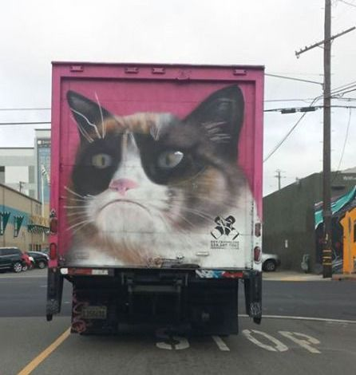
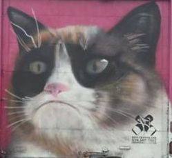
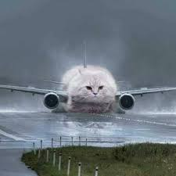
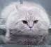

## Is this a cat?

For my matrix method (18.065) class's final project, we're trying to see how SVD compression affects a neural net's ability to correctly classify an image's subject. We used the cifar10 dataset to train our model, so it is currently able to identify objects of the following classes: 'airplane', 'automobile', 'bird', 'cat', 'deer', 'dog', 'frog', 'horse', 'ship', and 'truck'.

A friend sent me some photos for fun, which I tested without any SVD compression... and led to amusing outcomes:

[  994.0554    216.76369  -923.15607  -929.6404  -1233.5886   -583.8863   -3285.9697  -1273.9419    -20.88239  1090.2607 ] = <b>truck</b>

Our model refused to be confused by the cat face!

[  539.13586  -492.0714   -176.67567   591.12555  -644.5702    696.70026   -943.52905  1048.1892  -1223.8878    -50.58161] = <b>horse</b>

Hmm, so not quite.

[  522.943    1297.1592  -1781.3579  -1003.53906 -2256.0205  -1683.1914  -2341.4917   -486.34946  1026.9531    939.56   ] = <b>automobile</b>

Ah yes, the future of automobiles with wings and a face!

[ 284.75348   -423.04523    -91.05309    721.7166    -300.42218   592.8874    -642.69135     55.756886   -13.1496315 -831.19904  ] = <b>cat</b>

Heh, it got it! I'm actually pretty sure our model has yet to correctly identify a cat to date (of all the normal, legitimate cat photos we gave it), so kudos to it for figuring this one out.

